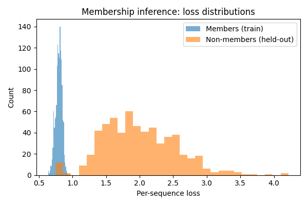

# ML Lab

A compact, production‑minded ML lab consisting of two main sections - a demo of core ML/DL concepts and a membership inference attack serving as a POC for IP protection.

## Project Structure

```
📁 ml-lab
├── 📁 demo                    # Core ML/DL concepts demo section of the lab
│   ├── 📁 common              # Common functions and variables
│   ├── 📁 data                # Datasets (auto-downloaded with torchvision)
│   ├── 📁 model               # Model definitions
│   ├── 📁 util                # Utility functions
│   ├── train_cnn_cifar10.py   # CNN on CIFAR-10
│   ├── train_mlp_mnist.py     # MLP on MNIST
│   ├── gradcam.py             # Grad-CAM visualization
│   ├── fgsm.py                # FGSM adversarial attack
│   ├── calibration.py         # Model calibration
│   └── watermark.py           # Watermarking
├── 📁 membership              # Membership inference attack POC section of the lab - WhisperTrace
│   ├── 📁 resource            # Pre-trained models and synthetic corpora
│   │   ├── 📁 checkpoints     # Trained models' checkpoints
│   │   ├── 📁 corpora         # This is where synthetic and scraped corpora are stored
│   │   └── 📁 runs            # Attack results (plots, scores), organized by date and time
│   └── 📁 src                 # Source code
│       ├── 📁 common          # Common functions and variables
│       ├── 📁 dataset         # Dataset functions
│       ├── 📁 vocab           # Vocabulary functions
│       ├── 📁 lm              # Language model functions
│       ├── 📁 util            # Utility functions
│       ├── build_corpus.py    # Build synthetic or scraped corpus
│       ├── train_lm.py        # Train LSTM language model on previously built corpus
│       └── attack.py          # Membership inference attack
├── .gitignore
├── LICENSE
├── Pipfile
└── README.md
```

## Dependencies

* [**Python 3.11:**](https://www.python.org/downloads/release/python-3110/) A high level programming language.
* [**Pipenv:**](https://pipenv.pypa.io/en/latest/) Python dependency management tool.
* [**Requests:**](https://docs.python-requests.org/en/latest/) HTTP library for Python.
* [**BeautifulSoup4:**](https://www.crummy.com/software/BeautifulSoup/bs4/doc/) Library for parsing HTML and XML documents.
* [**PyTorch:**](https://pytorch.org/) An open source machine learning framework.
* [**Torchvision:**](https://pytorch.org/vision/stable/index.html) Datasets, model architectures, and image transformations for computer vision.
* [**Torchaudio:**](https://pytorch.org/audio/stable/index.html) Audio I/O and transformations for deep learning.
* [**NumPy:**](https://numpy.org/) Fundamental package for scientific computing with Python.
* [**Pandas:**](https://pandas.pydata.org/) Data manipulation and analysis library.
* [**Scikit-learn:**](https://scikit-learn.org/stable/) Simple and efficient tools for predictive data analysis.
* [**Scikit-image:**](https://scikit-image.org/) Collection of algorithms for image processing.
* [**Matplotlib:**](https://matplotlib.org/) Comprehensive library for creating static, animated, and interactive visualizations in Python.
* [**Tqdm:**](https://tqdm.github.io/) Fast, extensible progress bar for Python and CLI.
* [**OpenCV-Python:**](https://opencv.org/) Library of programming functions mainly aimed at real-time computer vision.

## Installation

From the project root, run:

```bash
pipenv install
```

This installs dependencies for both sections in an isolated environment. To enter the environment, run:

```bash
pipenv shell
```

## Demo Section

Covers core ML/DL concepts:

* Clean training loops (MLP/CNN)
* Evaluation (ROC‑AUC/F1 + calibration)
* Interpretability (Grad‑CAM)
* Adversarial robustness (FGSM/PGD)
* Watermark robustness
* Lightweight observability

### Usage

From the `demo` root, run:

```bash
# Train simple models
python train_mlp_mnist.py --epochs 2
python train_cnn_cifar10.py --epochs 2

# Interpretability, robustness, calibration, watermarking
python gradcam.py
python fgsm.py --eps 0.03 --iters 10
python calibration.py
python watermark.py
```

Datasets are auto‑downloaded with `torchvision`. If offline, pre‑download to `~/.torch` or mirror locally.

## Membership Inference Attack Section - WhisperTrace

This demo shows a simple **membership inference attack** on a word-level LSTM language model trained on synthetic text.

### Usage

From the `membership/src` root:

1. List available resources (corpora and checkpoints):

```bash
python list_resources.py
```

2. Build a corpus of sentences:  
    1.1 You can either build a synthetic corpus of `n` sentences:

    ```bash
    python build_corpus.py --n 2000 --name-prefix synthetic
    ```

    1.2 Or scrape sentences from a webpage (e.g., [Wikipedia's article on LLG equation](https://en.wikipedia.org/wiki/Landau%E2%80%93Lifshitz%E2%80%93Gilbert_equation)):

    ```bash
    python build_corpus.py --url "https://en.wikipedia.org/wiki/Landau%E2%80%93Lifshitz%E2%80%93Gilbert_equation" --name-prefix wiki_llg_equation
    ```

3. Train a small LSTM LM on 70% (members) on previously built corpus:

```bash
python train_lm.py --corpus synthetic_2000 --epochs 100
```

4. Run membership inference attack:

```bash
python attack.py --checkpoint synthetic_2000__100
```

The attack reports **ROC-AUC** for distinguishing training vs held-out sentences, prints score `.csv` and records loss distribution histogram and ROC plots in the folder with current date and time under the `membership/resource/runs` directory. For example, for a run with the parameters above, here's the loss distribution histogram:



And here's the ROC curve:


For convenience, there are a couple of pre-trained checkpoints and both synthetic and scraped corpora in the `membership/resource` directory.

All scripts have `--help` flags for usage details and default values.
