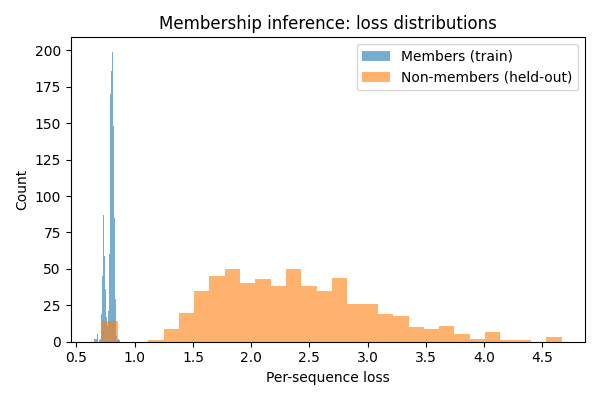
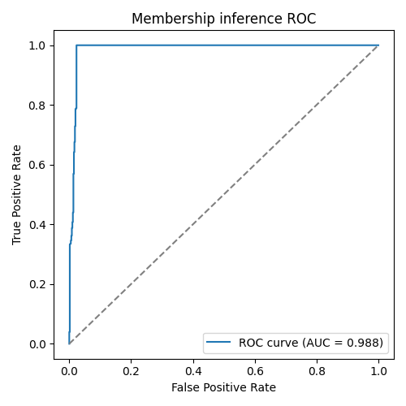

# ML Lab

A compact, production‑minded ML lab consisting of two main sections - a demo and a membership inference attack serving as a POC for IP protection.

## Installation

From the project root, run:

```bash
pipenv install
```

This installs dependencies for both sections in an isolated environment. To enter the environment, run:

```bash
pipenv shell
```

## Demo

Covers core ML/DL concepts:

* Clean training loops (MLP/CNN)
* Evaluation (ROC‑AUC/F1 + calibration)
* Interpretability (Grad‑CAM)
* Adversarial robustness (FGSM/PGD)
* Watermark robustness
* Lightweight observability

### Usage

From the `demo` root, run:

```bash
# Train simple models
python train_mlp_mnist.py --epochs 2
python train_cnn_cifar10.py --epochs 2

# Interpretability, robustness, calibration, watermarking
python gradcam.py
python fgsm.py --eps 0.03 --iters 10
python calibration.py
python watermark.py
```

Datasets are auto‑downloaded with `torchvision`. If offline, pre‑download to `~/.torch` or mirror locally.

## Membership Inference Attack

This demo shows a simple **membership inference attack** on a word-level LSTM language model trained on synthetic text.

### Usage

From the `membership/src` root:

1. Build a synthetic corpus of sentences:

```bash
python build_corpus.py --n 2000 --out synthetic_corpus
```

2. Train a small LSTM LM on 70% (members):

```bash
python train_lm.py --corpus synthetic_corpus_2000 --epochs 500
```

3. Run membership inference attack:

```bash
python attack.py --corpus synthetic_corpus_2000 --checkpoint lm_2000_500
```

The attack reports **ROC-AUC** for distinguishing training vs held-out sentences, prints score `.csv` and records loss distribution histogram and ROC plots in the folder with current date and time under the `membership/resource/runs` directory. For example, for a run with the parameters above, here's the loss distribution histogram:



And here's the ROC curve:



For convenience, there are a couple of pre-trained checkpoints and synthetic corpora in the `membership/resource` directory.

All scripts have `--help` flags for usage details.
